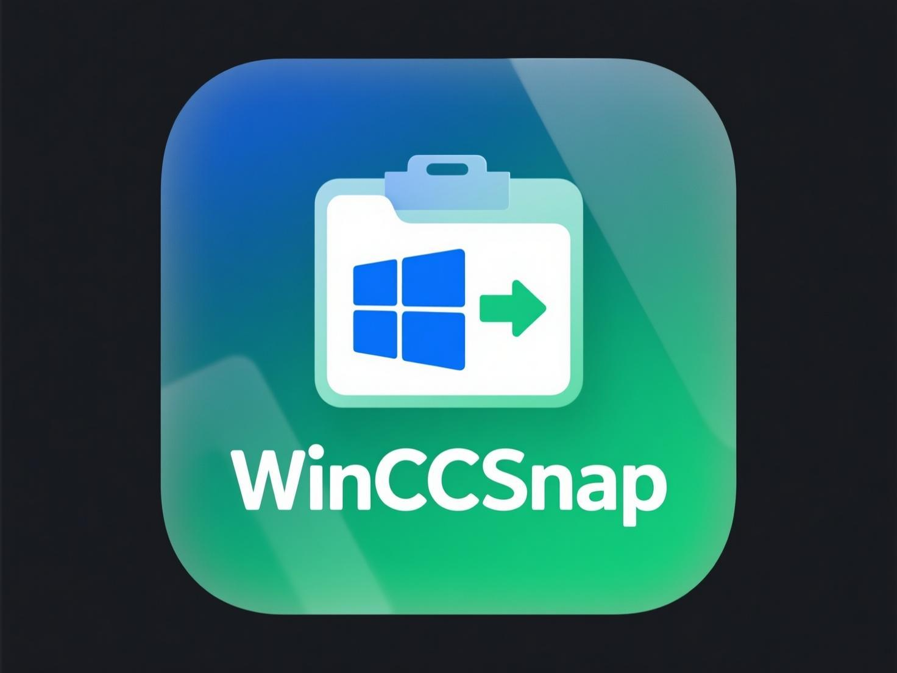

# WinCCSnap

<p align="center">
  
</p>

<p align="center">
  <a href="README.md">🇺🇸 English</a> | <a href="README.zh-CN.md">🇨🇳 中文文档</a>
</p>

<p align="center">
  
  
  
</p>

A lightweight PowerShell utility that enables clipboard image pasting into Claude Code on Windows by automatically converting CF_BITMAP to PNG format.

> **💡 This project was generated by Claude Code** - A clipboard enhancement tool designed specifically for Windows users of Claude Code

## 🎯 Problem Solved

Claude Code on Windows currently doesn't support pasting clipboard bitmap images directly. When you take a screenshot with `Win+Shift+S`, the image gets stored as CF_BITMAP format which Claude Code cannot process.

**Before:** Screenshot → Clipboard → ❌ Cannot paste into Claude Code  
**After:** Screenshot → WinCCSnap → PNG → ✅ Direct paste into Claude Code

## ✨ Features

- **Zero Configuration**: Install once, works immediately
- **Real-time Conversion**: Automatically converts bitmap to PNG
- **Background Service**: Runs silently with minimal CPU usage
- **Immediate Effect**: No restart required after installation
- **Battery Friendly**: Optimized for laptops
- **Clean Uninstall**: Complete removal when no longer needed

## 🚀 Quick Start

### 1. Installation

Open PowerShell as Administrator and run:

```powershell
# Download and install
iwr -useb https://raw.githubusercontent.com/calmzealA/WinCCSnap/main/WinCCSnap.ps1 | iex
.\WinCCSnap.ps1 install
```

### 2. Usage

After installation, you can immediately use screenshots in Claude Code:

1. Press `Win+Shift+S` to take a screenshot
2. Switch to Claude Code
3. Press `Ctrl+V` to paste the image

### 3. Management Commands

```powershell
# Check installation status
.\WinCCSnap.ps1 info

# Remove completely
.\WinCCSnap.ps1 remove

# Show help
.\WinCCSnap.ps1 help
```

## 🔧 Technical Details

### Architecture
- **Listener**: Background PowerShell job monitoring clipboard
- **Converter**: .NET System.Windows.Forms for image processing
- **Storage**: Temporary PNG files in `%TEMP%\clip.png`
- **Trigger**: 500ms polling interval with <1% CPU usage

### Security
- Runs under current user context (not system)
- No network access required
- No persistent data storage
- Clean removal leaves no traces

## 📊 System Requirements

- Windows 10 or later
- PowerShell 5.1 or later
- .NET Framework 4.0 or later (built-in)
- Administrator privileges for installation

## 🛠️ Development

### Manual Installation
```powershell
git clone https://github.com/calmzealA/WinCCSnap.git
cd WinCCSnap
.\WinCCSnap.ps1 install
```

### Debugging
```powershell
# Check running processes
Get-Job -Name "WinCCSnapListener"

# View logs
Get-ScheduledTaskInfo -TaskName "WinCCSnapListener"

# Manual trigger
schtasks /run /tn WinCCSnapListener
```

## 🤝 Contributing

1. Fork the repository
2. Create a feature branch
3. Make your changes
4. Test thoroughly
5. Submit a pull request

## 📄 License

MIT License - see [LICENSE](LICENSE) file for details.

## 🙏 Acknowledgments

- Inspired by the clipboard handling in WeChat
- Built with PowerShell and .NET Framework
- Optimized for Claude Code workflows

---

**中文文档**: [README.zh-CN.md](README.zh-CN.md)