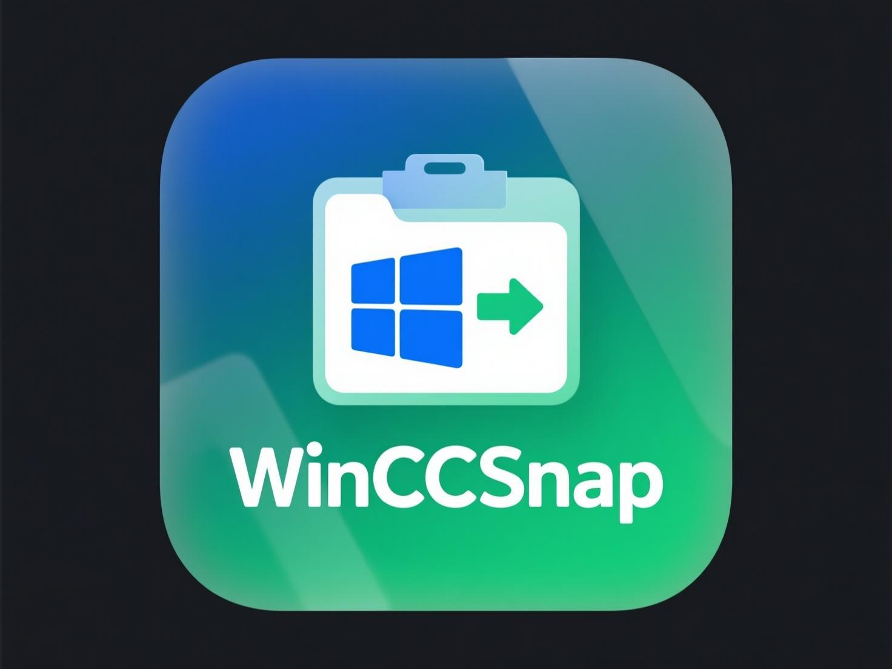

# WinCCSnap

<p align="center">
  
</p>

<p align="center">
  <a href="README.zh-CN.md">🇨🇳 中文文档</a> | <a href="README.md">🇺🇸 English</a>
</p>

<p align="center">
  
  
  
</p>

让 Windows 用户能够在 Claude Code 中直接粘贴剪贴板图片的轻量级 PowerShell 工具，自动将 CF_BITMAP 转换为 PNG 格式。

> **💡 本项目由 Claude Code 生成** - 专为 Windows 用户设计的 Claude Code 剪贴板增强工具

## 🎯 解决的问题

Windows 版 Claude Code 目前不支持直接粘贴剪贴板位图图片。当你使用 `Win+Shift+S` 截图时，图片以 CF_BITMAP 格式存储，Claude Code 无法处理。

**使用前：** 截图 → 剪贴板 → ❌ 无法粘贴到 Claude Code  
**使用后：** 截图 → WinCCSnap → PNG → ✅ 可直接粘贴到 Claude Code

## ✨ 特性

- **零配置**：一次安装，立即生效
- **实时转换**：自动将位图转换为 PNG
- **后台服务**：静默运行，CPU 占用极低
- **即时生效**：安装后无需重启
- **电池友好**：针对笔记本优化
- **干净卸载**：需要时可完全移除

## 🚀 快速开始

### 1. 安装

以管理员身份打开 PowerShell 并运行：

```powershell
# 下载并安装
iwr -useb https://raw.githubusercontent.com/calmzealA/WinCCSnap/main/WinCCSnap.ps1 | iex
.\WinCCSnap.ps1 install
```

### 2. 使用

安装完成后，可立即在 Claude Code 中使用截图：

1. 按 `Win+Shift+S` 截图
2. 切换到 Claude Code
3. 按 `Ctrl+V` 粘贴图片

### 3. 管理命令

```powershell
# 检查安装状态
.\WinCCSnap.ps1 info

# 完全移除
.\WinCCSnap.ps1 remove

# 显示帮助
.\WinCCSnap.ps1 help
```

## 🔧 技术细节

### 架构
- **监听器**：后台 PowerShell 作业监控剪贴板
- **转换器**：使用 .NET System.Windows.Forms 处理图片
- **存储**：临时 PNG 文件保存在 `%TEMP%\clip.png`
- **触发**：500ms 轮询间隔，CPU 占用 <1%

### 安全性
- 以当前用户上下文运行（非系统权限）
- 无需网络访问
- 无持久化数据存储
- 干净卸载不留痕迹

## 📊 系统要求

- Windows 10 或更高版本
- PowerShell 5.1 或更高版本
- .NET Framework 4.0 或更高版本（内置）
- 安装需要管理员权限

## 🛠️ 开发

### 手动安装
```powershell
git clone https://github.com/calmzealA/WinCCSnap.git
cd WinCCSnap
.\WinCCSnap.ps1 install
```

### 调试
```powershell
# 检查运行中的进程
Get-Job -Name "WinCCSnapListener"

# 查看日志
Get-ScheduledTaskInfo -TaskName "WinCCSnapListener"

# 手动触发
schtasks /run /tn WinCCSnapListener
```

## 🤝 贡献

1. Fork 本仓库
2. 创建功能分支
3. 进行更改
4. 充分测试
5. 提交 Pull Request

## 📄 许可证

MIT 许可证 - 详见 [LICENSE](LICENSE) 文件

## 🙏 致谢

- 灵感来源于微信的剪贴板处理机制
- 基于 PowerShell 和 .NET Framework 构建
- 专为 Claude Code 工作流程优化

---

**中文文档**: [README.zh-CN.md](README.zh-CN.md)